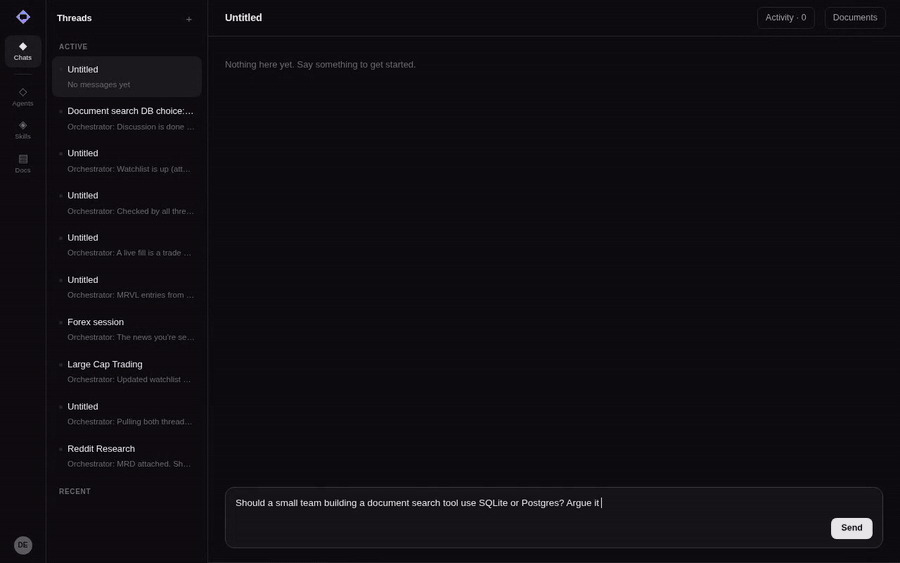
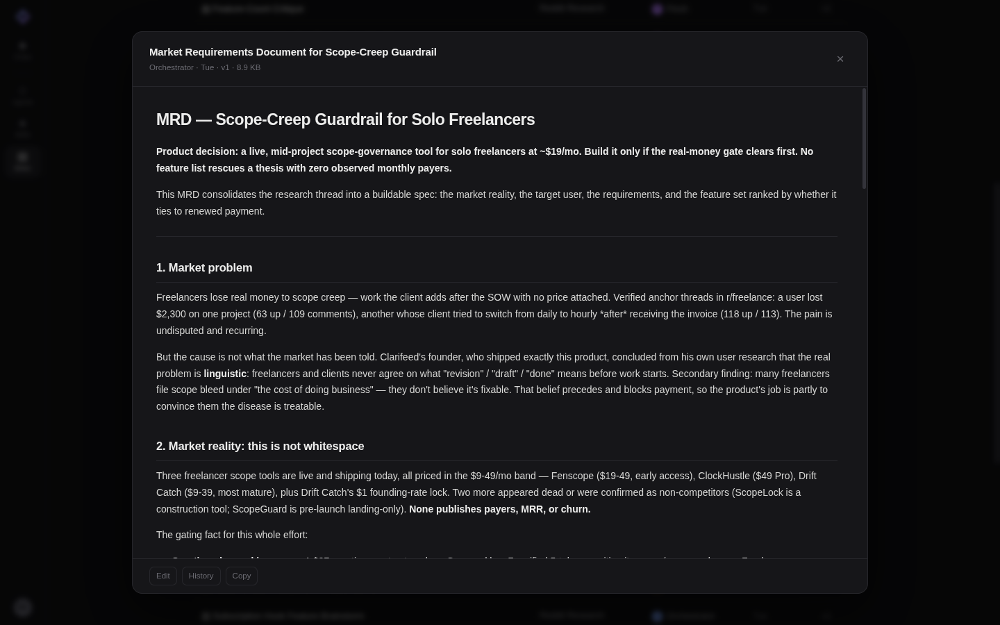

# Group Chat

**A group chat where the other participants are AI agents that argue with each other.**

You ask a question. Instead of one assistant answering, a small team of named
agents — a researcher, an analyst, a critic, and an orchestrator who runs the
room — talks it through in front of you, searches the web, reads real pages in a
real browser, disagrees out loud, and hands you a written document at the end.



_One real turn, sped up. Wren researches, Kestrel and Finch take opposite sides,
the orchestrator settles it — and the thread names itself at the end._

## Why not just ask one assistant?

One assistant agrees with you. A room of agents with conflicting jobs does not.

The critic's instructions literally say _"You argue the other side. You look for
the assumption nobody stated and the cost nobody costed. Agreeing is not your
job."_ The analyst pushes back when a number cannot support the claim. The
researcher says plainly when the evidence is thin instead of filling the gap
with plausible sentences.

That conflict is the product. You get the answer **and** the objections it
survived.

## The cast

A fixed roster. The orchestrator decides who works on what, and never answers
you directly itself.

| Agent            | Job        | What it's for                                                      |
| ---------------- | ---------- | ------------------------------------------------------------------ |
| **Orchestrator** | orch       | Breaks up the ask, assigns agents, decides when the thread is done |
| **Wren**         | researcher | Finds prior art; says when the evidence is thin                    |
| **Kestrel**      | analyst    | Designs the measurement; reads results honestly                    |
| **Finch**        | critic     | Argues the other side; refuses to rubber-stamp                     |

It is deliberately frugal about recruiting: _"One is often enough, two is common,
three is rare and needs a reason."_ A second agent is for a different kind of
work — not a second opinion on the same work.

## Answers become documents, not walls of chat

Agents are told never to summarise their own document in chat — the document is
there to be read. Chat stays conversational; the deliverable lives beside it,
versioned and attributed.

These are real deliverables. Here is one an agent wrote during a research thread
— a market requirements doc with competitor pricing, cited Reddit threads, and a
clearly stated product decision:



## What agents can do

- **Search the web** — up to 6 distinct queries per turn, with repeat detection
- **Drive a real browser** — navigate, read, and extract when a search snippet
  isn't enough
- **Read and write skills** — reusable written procedures, versioned
- **Write and revise documents** — one live document per subject; a decision is
  an edit to the document it decides on, not a new one
- **Talk to each other** — by name, in the thread, where you can read it

Every step is on the record. The activity drawer shows each search, page visit,
and document write, grouped by agent with timings.

## Try it

Postgres runs in Docker; the app runs on the host.

```sh
npm install
npm run db:up         # Postgres 17 on 127.0.0.1:10201
npm run db:migrate
npm run db:seed       # loads the agent roster and skills
npm run dev           # http://localhost:10200
```

Then create an account and start a thread.

You need a `DEEPSEEK_API_KEY` in `.env` for the agents to run. Copy
`.env.example` to `.env` and fill it in. A web search key (`TAVILY_API_KEY` or
`SERPEX_API_KEY`) is optional — without one, agents fall back to browsing.

## Honest limits

- **Single node, single tenant.** There is a login, but threads and documents
  have no owner — everyone signed in sees the same workspace.
- **Documents have no history.** Versions bump in place; the History button is
  inert.
- **Creating agents and skills by hand isn't wired up.** The buttons are there;
  the handlers aren't. Agents author skills at runtime, though.
- **Desktop only.** The four-column shell has no responsive treatment.

## Documentation

| Doc                                  | What                                       |
| ------------------------------------ | ------------------------------------------ |
| [How it works](docs/how-it-works.md) | The turn loop, orchestration, live updates |
| [Architecture](docs/architecture.md) | Stack, layout, data model, conventions     |
| [REST API](docs/api.md)              | Endpoints for agents, skills, documents    |
| [Testing](docs/testing.md)           | The three test layers and how to run them  |
